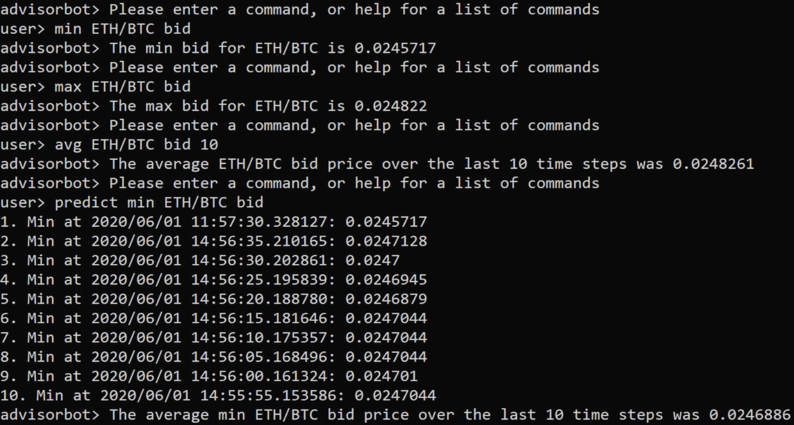

# AdvisorBot

## About

AdvisorBot is a command line program written in C++ that can carry out various tasks to help a cryptocurrency investor analyse the data available on an exchange. The program utilises object-oriented programming to organize code into modular, reusable objects for efficient development and maintenance.

## Executable commands

Here is a list of commands that can be executed in the program:

### C1: help

Command: `help`

Purpose: list all available commands

Example:

user> help

advisorbot> The available commands are help, help <cmd>, prod, min, max, avg, predict, time, step, enter, retrieve, delete, wallet and sales

### C2: help cmd

Command: `help cmd`

Purpose: output help for the specified command

Example:

user> help avg

avg ETH/BTC bid 10 -> average ETH/BTC bid over last 10 time steps

### C3: prod

Command: `prod`

Purpose: list available products

Example:

user> prod

advisorbot> ETH/BTC, DOGE/BTC

### C4: min

Command: `min product bid/ask`

Purpose: find minimum bid or ask for product in current time step

Example:

user> min ETH/BTC ask

advisorbot> The min ask for ETH/BTC is 1.0

### C5: max

Command: `max product bid/ask`

Purpose: find maximum bid or ask for product in current time step

Example:

user> max ETH/BTC ask

advisorbot> The max ask for ETH/BTC is 1.0

### C6: avg

Command: `avg product bid/ask timesteps`

Purpose: compute average bid or ask for the sent product over the sent number of time steps

Example:

user> avg ETH/BTC ask 10

advisorbot> The average ETH/BTC ask price over the last 10 timesteps was 1.0

### C7: predict

Command: `predict min/max product bid/ask`

Purpose: predict min or max bid or ask for the sent product for the next time step

Example:

user> predict max ETH/BTC bid

advisorbot> The average ETH/BTC ask price over the last 10 timesteps was 1.0

### C8: time

Command: `time`

Purpose: state current time in dataset, i.e. which timeframe are we looking at

Example:

user> time

advisorbot> 2020/03/17 17:01:24

### C9: step

Command: `step`

Purpose: move to next time step

Example:

user> step

advisorbot> now at 2020/03/17 17:01:30

### C10: enter

Command: `enter bid/ask product price amount`

Purpose: enter a bid or ask

Example:

user> enter bid ETH/BTC 0.02 10

advisorbot> Wallet looks good

### C11: retrieve

Command: `retrieve`

Purpose: list all the bids and asks entered by the user

Example:

user> retrieve

advisorbot> ask BTC/USDT 0.5 1

bid ETH/BTC 0.02 10

### C12: delete

Command: `delete bid/ask product price amount`

Purpose: delete a bid or ask entered by the user

Example:

user> delete bid ETH/BTC 0.02 10

advisorbot> Delete successful

### C13: wallet

Command: `wallet`

Purpose: print all the currencies in the user's wallet

Example:

user> wallet

advisorbot> Your wallet contains:

BTC: 9.000000

USDT: 0.500000

### C14: sales

Command: `sales`

Purpose: process all the bids and asks entered by the user

Example:

user> sales

advisorbot> Matching BTC/USDT

Sales: 1

Sale price: 0.5, Sale amount: 1

Matching DOGE/BTC

Sales: 0

Matching DOGE/USDT

Sales: 0

Matching ETH/BTC

Sales: 0

Matching ETH/USDT

Sales: 0
